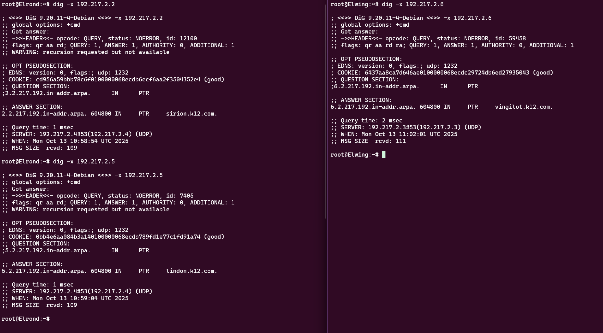

# LAPORAN PRAKTIKUM MODUL 2 JARINGAN KOMPUTER
**Kelompok K12**
| NRP | Nama |
|---|---|
| 5027241038 | Moch. Rizki Nasrullah |
| 5027241060 | Bima Aria Perthama |

---

## Daftar Isi
- [Soal 1-3](#soal-1-3-setup-topologi-dan-konfigurasi-jaringan)
- [Soal 4](#soal-4-konfigurasi-dns-master-dan-slave-server)
- [Soal 5](#soal-5-menambahkan-record-dns-untuk-semua-node)
- [Soal 6](#soal-6-testing-dns-replication)
- [Soal 7](#soal-7-konfigurasi-cname-record)
- [Soal 8](#soal-8-reverse-dns-lookup)
- [Soal 9](#soal-9-web-server-statis-dengan-nginx)
- [Soal 10](#soal-10-web-server-dinamis-dengan-php-fpm)

---

## Soal 1-3: Setup Topologi dan Konfigurasi Jaringan

### Deskripsi
Pada tahap awal praktikum, kita melakukan setup topologi jaringan lengkap untuk kelompok K12. Tahap ini mencakup pembuatan topologi jaringan, konfigurasi interface pada setiap node, setup routing, dan persiapan environment untuk DNS server dan web server.

### Topologi Jaringan
Topologi yang digunakan terdiri dari beberapa subnet dengan node-node sebagai berikut:

**Subnet 192.217.1.0/24:**
- Earendil (192.217.1.2)
- Elwing (192.217.1.3)

**Subnet 192.217.2.0/24:**
- Sirion - Router (192.217.2.2)
- Tirion - DNS Master/NS1 (192.217.2.3)
- Valmor - DNS Slave/NS2 (192.217.2.4)
- Lindon - Static Web Server (192.217.2.5)
- Vingilot - Dynamic Web Server (192.217.2.6)

**Subnet 192.217.3.0/24:**
- Cirdan (192.217.3.2)
- Elrond (192.217.3.3)
- Maglor (192.217.3.4)

### Langkah Pengerjaan

#### 1. Membuat Topologi Jaringan
Membuat topologi sesuai dengan spesifikasi modul menggunakan GNS3 atau tool network simulator lainnya. Topologi terdiri dari:
- 1 Router utama (Sirion) yang terhubung ke 3 subnet
- 2 DNS Server (Master dan Slave)
- 2 Web Server (Static dan Dynamic)
- 6 Client node untuk testing

#### 2. Konfigurasi Network Interface
Setiap node dikonfigurasi dengan IP address yang sesuai dengan subnet masing-masing:

**Contoh konfigurasi di Router Sirion:**
```bash
# Interface ke subnet 192.217.1.0/24
auto eth0
iface eth0 inet static
    address 192.217.1.1
    netmask 255.255.255.0

# Interface ke subnet 192.217.2.0/24
auto eth1
iface eth1 inet static
    address 192.217.2.2
    netmask 255.255.255.0

# Interface ke subnet 192.217.3.0/24
auto eth2
iface eth2 inet static
    address 192.217.3.1
    netmask 255.255.255.0

# Interface ke internet
auto eth3
iface eth3 inet dhcp
```

**Contoh konfigurasi di Client/Server Node:**
```bash
auto eth0
iface eth0 inet static
    address 192.217.x.x
    netmask 255.255.255.0
    gateway 192.217.x.1
```


#### 3. Konfigurasi DNS Resolver Sementara
Sebelum DNS server sendiri aktif, kita set DNS resolver ke DNS publik:

```bash
# Di setiap node
cat > /etc/resolv.conf << 'EOF'
nameserver 192.168.122.1
nameserver 8.8.8.8
EOF
```

#### 4. Testing Konektivitas
Testing koneksi antar node dan ke internet:

```bash
# Test ping antar subnet
ping -c 3 192.217.1.2  # ke Earendil
ping -c 3 192.217.2.3  # ke Tirion
ping -c 3 192.217.3.2  # ke Cirdan

# Test koneksi internet
ping -c 3 google.com
```

#### 6. Update Repository dan Instalasi Paket Dasar
Di semua node yang memerlukan, update repository dan install paket yang diperlukan:

```bash
# Update repository
apt-get update

# Install paket dasar
apt-get install -y nano wget curl dnsutils

# Di DNS Server (Tirion & Valmor)
apt-get install -y bind9

# Di Web Server (Lindon)
apt-get install -y nginx

# Di Web Server (Vingilot)
apt-get install -y nginx php-fpm

# Di Client untuk testing
apt-get install -y lynx
```

#### 7. Verifikasi Setup
Pastikan semua konfigurasi berjalan dengan baik:
- Semua node dapat ping ke gateway masing-masing
- Semua node dapat ping ke node di subnet lain
- Semua node dapat mengakses internet
- Paket-paket yang diperlukan terinstall dengan baik

### Dokumentasi


Dokumentasi menunjukkan topologi jaringan telah berhasil dibuat dan dikonfigurasi dengan baik. Semua node dapat saling berkomunikasi dan memiliki akses ke internet.

---

## Soal 4: Konfigurasi DNS Master dan Slave Server

### Deskripsi
Pada soal ini, kita diminta untuk mengkonfigurasi DNS server dengan arsitektur Master-Slave. DNS Master akan berjalan di node Tirion dan DNS Slave di node Valmor. Domain yang digunakan adalah `k12.com` dengan setup zone transfer dan notifikasi otomatis.

### Langkah Pengerjaan

#### 1. Setup DNS Master di Tirion (NS1)
Pertama, kita melakukan instalasi bind9 dan membuat symbolic link untuk memudahkan management:

```bash
apt-get update
apt-get install bind9 -y
ln -s /etc/init.d/named /etc/init.d/bind9
```

#### 2. Konfigurasi named.conf.local
Membuat konfigurasi zone untuk domain k12.com dengan fitur notifikasi dan transfer zone ke slave:

```bash
zone "k12.com" {
    type master;
    file "/etc/bind/k12/k12.com";
    notify yes;
    also-notify { 192.217.2.4; };
    allow-transfer {192.217.2.4;};
};
```

Penjelasan:
- `type master`: menandakan ini adalah DNS master
- `notify yes`: mengaktifkan notifikasi otomatis ke slave
- `also-notify`: IP address slave server (Valmor)
- `allow-transfer`: mengizinkan zone transfer ke IP slave

#### 3. Konfigurasi named.conf.options
Setup DNS forwarder dan allow query dari semua client:

```bash
options {
    directory "/var/cache/bind";
    forwarders {
        192.168.122.1;
    };
    dnssec-validation no;
    allow-query{any;};
    auth-nxdomain no;
    listen-on-v6 { any; };
};
```

#### 4. Membuat Zone Template
Membuat template zone yang akan digunakan sebagai base:

```bash
mkdir /etc/bind/k12
cat > /etc/bind/zone.template << 'EOF'
$TTL    604800
@       IN      SOA     localhost. root.localhost. (
                        2025100401
                        604800
                        86400
                        2419200
                        604800 )
;
@       IN      NS      localhost.
@       IN      A       127.0.0.1
EOF
```

#### 5. Konfigurasi Zone File untuk k12.com
Membuat zone file dengan record NS dan A yang sesuai:

```bash
cat > /etc/bind/k12/k12.com << 'EOF'
$TTL    604800
@       IN      SOA     k12.com. root.k12.com. (
                        2025100401
                        604800
                        86400
                        2419200
                        604800 )
;
@       IN      NS      ns1.k12.com.
@       IN      NS      ns2.k12.com.

ns1      IN      A       192.217.2.3
ns2      IN      A       192.217.2.4

@       IN      A       192.217.2.2
EOF

service bind9 restart
```

#### 6. Setup DNS Slave di Valmor (NS2)
Instalasi bind9 dan konfigurasi sebagai slave:

```bash
apt-get update
apt-get install bind9 -y
ln -s /etc/init.d/named /etc/init.d/bind9

cat > /etc/bind/named.conf.local << 'EOF'
zone "k12.com" {
    type slave;
    file "/etc/bind/k12/k12.com";
    masters {192.217.2.3;};
};
EOF

service bind9 restart
```

#### 7. Konfigurasi DNS Resolver di Client
Setting nameserver di client untuk menggunakan kedua DNS server:

```bash
cat > /etc/resolv.conf << 'EOF'
nameserver 192.217.2.3
nameserver 192.217.2.4
nameserver 192.168.122.1
EOF
```

### Dokumentasi


Pada dokumentasi terlihat bahwa konfigurasi DNS Master-Slave berhasil dan dapat melakukan zone transfer dengan baik.

---

## Soal 5: Menambahkan Record DNS untuk Semua Node

### Deskripsi
Menambahkan A record untuk semua node dalam topologi ke zone file DNS master. Ini memungkinkan setiap node dapat di-resolve menggunakan nama hostname.

### Langkah Pengerjaan

#### 1. Update Zone File di Tirion (NS1)
Menambahkan record A untuk seluruh node dalam jaringan:

```bash
cat > /etc/bind/k12/k12.com << 'EOF'
$TTL    604800
@       IN      SOA     k12.com. root.k12.com. (
                        2025100411
                        604800
                        86400
                        2419200
                        604800 )
;

@       IN      NS      ns1.k12.com.
@       IN      NS      ns2.k12.com.

ns1      IN      A       192.217.2.3
ns2      IN      A       192.217.2.4
earendil IN      A       192.217.1.2
elwing   IN      A       192.217.1.3
cirdan   IN      A       192.217.3.2
elrond   IN      A       192.217.3.3
maglor   IN      A       192.217.3.4
lindon   IN      A       192.217.2.5
vingilot IN      A       192.217.2.6
sirion   IN      A       192.217.2.2

@       IN      A       192.217.2.2
EOF

service bind9 restart
```

#### 2. Penjelasan Record
- Serial number dinaikkan menjadi `2025100411` untuk menandakan perubahan
- Setiap node memiliki A record yang mengarah ke IP address masing-masing
- NS record untuk ns1 dan ns2 tetap dipertahankan
- Root domain (@) mengarah ke IP Sirion sebagai main entry point

#### 3. Testing DNS Resolution
Setelah konfigurasi, zone akan otomatis ter-transfer ke slave server Valmor karena sudah dikonfigurasi zone transfer di soal 4.

### Dokumentasi


Dokumentasi menunjukkan semua hostname dapat di-resolve dengan benar ke IP address yang sesuai.

---

## Soal 6: Testing DNS Replication

### Deskripsi
Melakukan testing untuk memastikan DNS replication berjalan dengan baik antara master dan slave server menggunakan perintah dig.

### Langkah Pengerjaan

#### 1. Instalasi Tool untuk Testing
Di node Valimar, install journalctl untuk melihat log system:

```bash
apt-get update && apt-get install -y journalctl
```

#### 2. Query ke DNS Master (Tirion)
Melakukan query SOA record ke master server:

```bash
dig @192.217.2.3 k12.com SOA
```

Perintah ini akan menampilkan:
- Serial number dari zone
- Refresh, retry, dan expire time
- TTL values
- Authoritative nameserver

#### 3. Query ke DNS Slave (Valmor)
Melakukan query yang sama ke slave server:

```bash
dig @192.217.2.4 k12.com SOA
```

#### 4. Verifikasi Serial Number
Kedua query harus menunjukkan serial number yang sama, yang membuktikan zone transfer berhasil. Serial number yang diharapkan adalah `2025100411`.

### Dokumentasi


Dokumentasi menunjukkan bahwa serial number dan SOA record sama di kedua server, membuktikan replikasi DNS berjalan dengan baik.

---

## Soal 7: Konfigurasi CNAME Record

### Deskripsi
Menambahkan CNAME record untuk membuat alias domain yang mengarah ke hostname tertentu. Ini berguna untuk memberikan nama alternatif untuk service yang sama.

### Langkah Pengerjaan

#### 1. Update Zone File dengan CNAME
Di Tirion (Master), tambahkan CNAME record ke zone file:

```bash
cat > /etc/bind/k12/k12.com << 'EOF'
$TTL    604800
@       IN      SOA     k12.com. root.k12.com. (
                        2025100413
                        604800
                        86400
                        2419200
                        604800 )
;

@       IN      NS      ns1.k12.com.
@       IN      NS      ns2.k12.com.

@       IN      A       192.217.2.2

ns1      IN      A       192.217.2.3
ns2      IN      A       192.217.2.4
earendil IN      A       192.217.1.2
elwing   IN      A       192.217.1.3
cirdan   IN      A       192.217.3.2
elrond   IN      A       192.217.3.3
maglor   IN      A       192.217.3.4
lindon   IN      A       192.217.2.5
vingilot IN      A       192.217.2.6
sirion   IN      A       192.217.2.2

www      IN      CNAME  sirion
static   IN      CNAME  lindon
app      IN      CNAME  vingilot

EOF
```

#### 2. Penjelasan CNAME Record
- `www.k12.com` → alias untuk `sirion.k12.com`
- `static.k12.com` → alias untuk `lindon.k12.com` (static web server)
- `app.k12.com` → alias untuk `vingilot.k12.com` (dynamic web server)

CNAME record berfungsi sebagai canonical name atau alias. Ketika client melakukan query ke www.k12.com, DNS akan resolve ke sirion.k12.com, kemudian ke IP address sirion.

#### 3. Testing CNAME Resolution
Dari client (Elwing atau Elrond), test menggunakan perintah host:

```bash
host www.k12.com
host static.k12.com
host app.k12.com
```

Setiap command akan menunjukkan:
1. CNAME record mengarah ke hostname target
2. Hostname target memiliki A record ke IP address

### Dokumentasi


Dokumentasi menunjukkan CNAME record berhasil di-resolve dari client Elrond dan Elwing dengan benar.

---

## Soal 8: Reverse DNS Lookup

### Deskripsi
Konfigurasi Reverse DNS (PTR record) untuk melakukan reverse lookup dari IP address ke hostname. Reverse DNS berguna untuk verifikasi identitas server dan sering digunakan untuk email server validation.

### Langkah Pengerjaan

#### 1. Setup Reverse Zone di Tirion (Master)
Tambahkan konfigurasi reverse zone di named.conf.local:

```bash
cat >> /etc/bind/named.conf.local << 'EOF'
zone "2.217.192.in-addr.arpa" {
    type master;
    file "/etc/bind/k12/2.217.192.in-addr.arpa";
    notify yes;
    also-notify { 192.217.2.4; };
    allow-transfer { 192.217.2.4; };
};
EOF
```

Penjelasan:
- Zone name format untuk reverse DNS: `<reversed-network>.in-addr.arpa`
- Untuk subnet 192.217.2.0/24, zone name-nya adalah `2.217.192.in-addr.arpa`
- Sama seperti forward zone, kita enable notifikasi dan zone transfer ke slave

#### 2. Membuat Reverse Zone File
Buat file zone untuk reverse lookup:

```bash
cat > /etc/bind/k12/2.217.192.in-addr.arpa << 'EOF'
$TTL    604800
@       IN      SOA     k12.com. root.k12.com. (
                        2025100406
                        604800
                        86400
                        2419200
                        604800 )
;

@       IN      NS      ns1.k12.com.
@       IN      NS      ns2.k12.com.

3      IN      PTR     ns1.k12.com.
4      IN      PTR     ns2.k12.com.
2      IN      PTR     sirion.k12.com.
5      IN      PTR     lindon.k12.com.
6      IN      PTR     vingilot.k12.com.

EOF

service bind9 restart
```

Penjelasan PTR record:
- Angka di kolom pertama adalah oktet terakhir dari IP address
- PTR mengarah ke fully qualified domain name (harus diakhiri dengan titik)
- Contoh: `3 IN PTR ns1.k12.com.` artinya IP 192.217.2.3 → ns1.k12.com

#### 3. Setup Reverse Zone di Valmor (Slave)
Tambahkan konfigurasi slave untuk reverse zone:

```bash
cat >> /etc/bind/named.conf.local << 'EOF'
zone "2.217.192.in-addr.arpa" {
    type slave;
    file "/etc/bind/slave/2.217.192.in-addr.arpa";
    masters { 192.217.2.3; };
};
EOF

service bind9 restart
```

#### 4. Testing Reverse DNS
Testing dapat dilakukan menggunakan:
```bash
dig -x 192.217.2.3
dig -x 192.217.2.2
host 192.217.2.5
```

### Dokumentasi


Dokumentasi menunjukkan reverse DNS lookup berhasil mengkonversi IP address ke hostname dengan benar.

---

## Soal 9: Web Server Statis dengan Nginx

### Deskripsi
Setup web server statis menggunakan Nginx di node Lindon untuk melayani konten statis dengan fitur directory listing. Web server ini akan diakses melalui domain `static.k12.com`.

### Langkah Pengerjaan

#### 1. Instalasi Nginx di Lindon
Install web server nginx:

```bash
apt-get update
apt install nginx -y
```

#### 2. Membuat Directory untuk Website
Buat directory untuk menyimpan file website:

```bash
mkdir -p /var/www/static.k12.com
```

#### 3. Konfigurasi Virtual Host Nginx
Buat konfigurasi server block untuk static.k12.com:

```bash
cat > /etc/nginx/sites-available/static.k12.com << 'EOF'
server {
    listen 80;
    listen [::]:80;

    root /var/www/static.k12.com;

    index index.html index.htm;

    server_name static.k12.com;

    location / {
        try_files $uri $uri/ =404;
        autoindex on;
    }
}
EOF
```

Penjelasan konfigurasi:
- `listen 80`: mendengarkan di port 80 (HTTP)
- `root`: document root untuk website
- `server_name`: domain yang akan dilayani
- `autoindex on`: mengaktifkan directory listing
- `try_files`: mencoba serve file atau directory, jika tidak ada return 404

#### 4. Membuat Konten Website
Buat directory dan file untuk testing:

```bash
mkdir /var/www/static.k12.com/annals

echo "Arsip Dari Zaman Dahulu" > /var/www/static.k12.com/annals/arsip1.txt
echo "Arsip Dari Zaman Pertengahan" > /var/www/static.k12.com/annals/arsip2.txt
echo "Arsip Dari Zaman Modern" > /var/www/static.k12.com/annals/arsip3.txt

echo "<h1>Selamat Datang di Static.k12.com</h1>" > /var/www/static.k12.com/index.html
```

#### 5. Aktivasi Site dan Restart Nginx
Enable site dengan membuat symbolic link dan restart service:

```bash
ln -s /etc/nginx/sites-available/static.k12.com /etc/nginx/sites-enabled/
service nginx restart
```

#### 6. Testing dari Client
Di client, install lynx (text-based browser) dan akses website:

```bash
apt-get update
apt-get install -y lynx
lynx static.k12.com
```

Testing yang bisa dilakukan:
- Akses homepage: akan menampilkan index.html
- Akses directory annals: akan menampilkan directory listing dengan 3 file arsip
- Akses file: dapat membuka masing-masing file arsip

### Dokumentasi


Dokumentasi menunjukkan web server statis berhasil diakses dengan fitur directory listing berjalan dengan baik.

---

## Soal 10: Web Server Dinamis dengan PHP-FPM

### Deskripsi
Setup web server dinamis dengan Nginx dan PHP-FPM di node Vingilot untuk melayani konten dinamis PHP. Web server ini akan diakses melalui domain `app.k12.com` dan mengimplementasikan URL rewriting.

### Langkah Pengerjaan

#### 1. Instalasi Nginx dan PHP-FPM di Vingilot
Install paket yang diperlukan:

```bash
apt update
apt install nginx php-fpm -y
```

#### 2. Membuat Directory untuk Aplikasi
Buat directory untuk aplikasi web:

```bash
mkdir -p /var/www/app.k12.com
```

#### 3. Membuat File PHP - Index Page
Buat halaman utama dengan konten dinamis:

```bash
cat > /var/www/app.k12.com/index.php << 'EOF'
<!DOCTYPE html>
<html lang="en">
<head>
    <title>Halaman Utama</title>
</head>
<body>
    <h1>Selamat Datang di app.k12.com</h1>
    <p>Ini adalah halaman utama yang disajikan oleh PHP-FPM.</p>
    <p>Waktu server saat ini: <?php echo date('Y-m-d H:i:s'); ?></p>
    <a href="/about">Tentang Kami</a>
</body>
</html>
EOF
```

#### 4. Membuat File PHP - About Page
Buat halaman about untuk testing URL rewrite:

```bash
cat > /var/www/app.k12.com/about.php << 'EOF'
<!DOCTYPE html>
<html lang="en">
<head>
    <title>Tentang Kami</title>
</head>
<body>
    <h1>Halaman About Aplikasi Ini</h1>
    <p>Ini adalah halaman 'About' yang dibuat untuk menunjukkan rewrite URL.</p>
    <a href="/">Kembali ke Halaman Utama</a>
</body>
</html>
EOF
```

#### 5. Konfigurasi Nginx dengan PHP-FPM
Buat konfigurasi nginx untuk menjalankan PHP:

```bash
cat > /etc/nginx/sites-available/app.k12.com << 'EOF'
server {
    listen 80;
    server_name app.k12.com;
    root /var/www/app.k12.com;

    index index.php;

    location / {
        try_files $uri $uri/ $uri.php?$query_string;
    }

    location ~ \.php$ {
        include snippets/fastcgi-php.conf;
        fastcgi_pass unix:/var/run/php/php8.4-fpm.sock;
    }

    location ~ /\.ht {
        deny all;
    }
}
EOF
```

Penjelasan konfigurasi:
- `index index.php`: set index.php sebagai default file
- `try_files $uri $uri/ $uri.php?$query_string`: URL rewriting untuk clean URL
  - Mencoba file langsung
  - Mencoba directory
  - Jika tidak ada, coba tambahkan .php extension
- `location ~ \.php$`: handler untuk file PHP
- `fastcgi_pass`: socket untuk komunikasi dengan PHP-FPM
- `location ~ /\.ht`: security untuk mencegah akses ke file .htaccess

#### 6. Aktivasi Site dan Restart Services
Enable site dan restart semua service yang diperlukan:

```bash
ln -s /etc/nginx/sites-available/app.k12.com /etc/nginx/sites-enabled/
nginx -t
service php8.4-fpm restart
service nginx restart
```

Perintah `nginx -t` digunakan untuk test konfigurasi sebelum restart.

#### 7. Testing dari Client
Di client, akses aplikasi menggunakan lynx:

```bash
apt-get update
apt-get install -y lynx
lynx app.k12.com
lynx app.k12.com/about
```

Testing yang bisa dilakukan:
- Akses `app.k12.com` → akan menampilkan index.php dengan waktu server yang dinamis
- Akses `app.k12.com/about` → URL rewriting akan otomatis mengarahkan ke about.php
- Verifikasi konten dinamis PHP berjalan dengan melihat waktu server yang terupdate

### Dokumentasi


Dokumentasi menunjukkan web server dinamis dengan PHP-FPM berhasil diakses dan URL rewriting berjalan dengan baik. Halaman menampilkan konten dinamis PHP dan navigasi antar halaman berfungsi dengan clean URL.

---

